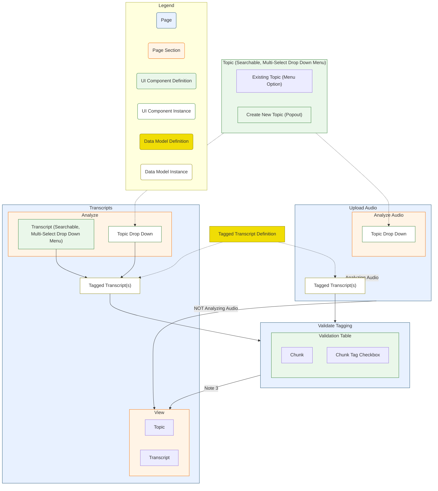

# 1 Complete the React UI Scaffolding stuff

# 2. Plan out the UI journey

> **Notes**
> 1. Create New Topic Popout
> 	- On Submit of form, refresh full Analyze page (ensures the Topic dropdown menu includes the new topic)
>	- Need to maintain state with the selections of the topics and transcripts so that if a user creates a new topic they don't have to re-enter previous selections.  State for the drop down menus should get cleared, however, if they do anything other than go through the process of creating a new topic.  Likely needs to be maintained throughout the process of validating the tagging to ensure that the view is correct
> 2. Validate Tagging
>	- For each chunk/topic combination within the transcript, have a checkbox that allows users to indicate whether that tag was captured correctly (defaults to the box being checked) and *capture both the initial and user feedback version of the tag within the data model*
>	- Within the UI, this will look like a table with the check box embedded as a row.  Only include the transcript column if the user is selecting multiple transcripts at once
>		|  Transcript  | Chunk Text | Tag 1 | Tag 2 | ... | Tag N |
>		| ------------ | ---------- | ----- | ----- | --- | ----- |
>       | Transcript 1 | asdfasdfad |  [x]  |  []   | []  |  [x]  |
> 3. Validated Tagging to View transition
>	- Ensure that the selected transcript(s) are maintained in state to ensure that the view transitions to the relevant transcript
>	- See discussion around maintaining state for the selections.
> 4. Transcript and Topic Selection
>	- Users should be able to select multiple transcripts and topics
>	- See discussion around maintaining state for the selections.
> 5. Transcripts Page Sidebar Menu
> 	- There needs to be a sidebar menu within the Transcripts page that 

# 3. Create clickable UI scaffolding
- ID MVP Critical Path

# 4. Create data model

# 5. Create dummy data that integrates data model into UI

# 6. Pull in actual tagging code

# 7. Create production deployment
