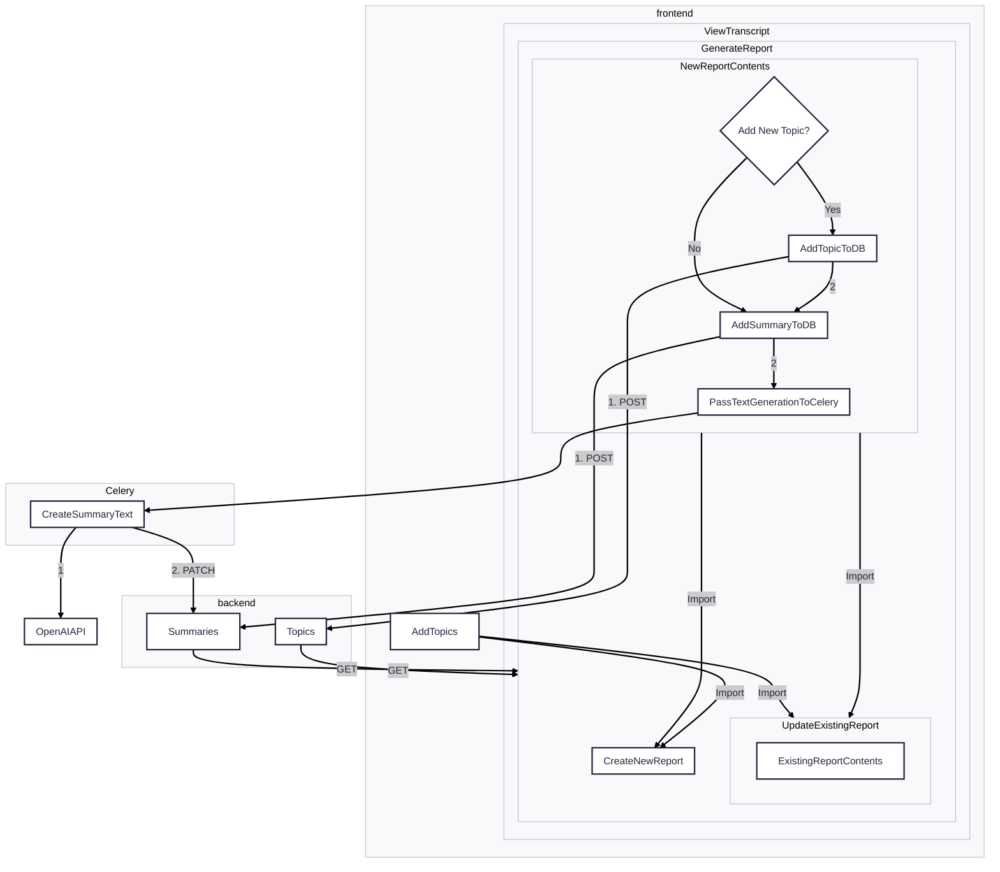

# Overview
## UI Journey
- [ ] Report generation happens within specific transcript page (not upload page)
- [ ] "Transcript Report" section visible through a checkbox selection like "Transcript Tags"
- [ ] Have different paths for "Create New" vs. "Update Existing" Report that are generated based on whether a report exists for a specific topic or not.
    - [ ] Update Existing: 
        - [ ] Link to download the word document (word document generated each time based on what is in the "Summary" table)
        - [ ] "Update Report" checkbox exposes a new section
            - [ ] Have an "Existing Report Contents" section that shows what topic summaries are in the current report (General Summaries are created automatically)
            - [ ] "New Contents" section lists all topics that aren't part of the existing report and allows user to create new topics (pull existing logic for creating topics in the database from [api_urls.py](./missourai_django/transcription/api_urls.py) and [view_topics.jsx](./frontend/src/view-topics.jsx) - will require refactoring `view_topics.jsx` to separate out the `newTopics` capability).
                - Error Handling: Add new state variable called `createdTopics`.  Before hitting sumbit, filter `newTopics` against `createdTopics`.  When a topic has successfully created, add it to that list.  If you get an error, prompt the user to resubmit and you will hit that re-render condition.
        - [ ] Button for initiating report process labeled "Generate Updated Report"
    - [ ] Create New:
        - [ ] Basically what is in the "New Contents"
        - [ ] Button for initiating report process labeled "Generate Report"
- [ ] Once the user submits a report request, redirect them to the transcript page and create a modal popup that tells them that the transcript is being created and another modal that tells them when the report is complete.
## Create UI and API Scaffolding
### Brainstorming

- [ ] Create `GenerateReport` component nested within Django template
    - [x] Create component and associated Django Infrastructure
    - [x] API Dependencies
        - [x] **Summaries** API Endpoint that returns records from the Summaries Table _for a specific transcript_ and then passes that down as props *only to `UpdateExistingReport` component*
        - [x] **Topics** API Endpoint that returns all topics and passes them to both `UpdateExistingReport` and `CreateNewReport`
    - [x] Create separate `UpdateExistingReport` and `CreateNewReport` Components
        - [x] Conditionally render based on whether the transcript has any related summaries (`UpdateExistingReport` if there are summaries, `CreateNewReport` if there aren't)
            - [x] **Unit Test**: Mock response with no records vs. some records and ensure that the correct component renders
            - [x] **Integration Test**: Mock DB with summaries for a single transcript and ensure when the frontend passes in the matching transcript id you get the `UpdateExistingReport` and when the id does not match you get `CreateNewReport` 
    - [ ] Both use the same `NewReportContents` component (naming TBD)
        - [ ] "New Contents" section component gets passed down the summaries (can be null) and, for the `UpdateExistingReport` component, removes the topics that are already in the summary from the list of topics that can be added
        - [ ] All of the elements from the new `AddTopics` component
    - [ ] Create `ExistingReportContents` component that is based on the data from the **Summaries** API Endpoint
- [ ] Refactor [view_topics.jsx](./frontend/src/view-topics.jsx)
    - [ ] Split out the add topics into a new component that can be imported
- [x] Create API Endpoint for Summaries
    - GET: Fairly straightforward
    - POST: Create the initial summary with only the Transcript, Summary Type, and Topic Fields; exclude the Summary Text field
    - PATCH: Add the Summary Text field
- [ ] Frontend Testing
    - [x] Create Mock Service Worker using React Testing Library
### Implementation Plan
1. Create bare bones React Components
    - Test: 
        - Ensure that all of the components show up within the larger `GenerateReport` component (default based on MSW returning Summaries should show `UpdateExistingReport`)
        - Both summaries and no summaries, ensure that with no summaries the `CreateNewReport` component appears
    - Test Set up
        - MSW: 
            - `GET` `/topics/` and `/summaries/`: Return Topics and Summaries by default
                - Filtering summaries for a specific topic
        - Provide override for no summaries
2. Create Individual React Components
3. Create Django Template
    - [x] Create Django template and include it within the View Transcripts page
    - [x] Create view that exposes API Endpoints
4. Create barebones DRF Components (model -> serializer -> ModelViewSet -> Route (api_urls.py))
    - [x] Summaries Serializer (serializers.py)
    - [x] ViewSet that allows for filtering (api_views.py)
    - [x] Route in api_urls.py
    - [x] Create test for API that shows the ability to pull out a summary for an existing transcript as well as ability to return none for a non-existent transcript.  What should this do in terms of error handling?
        - non-existent transcript check needs to look at both a transcript that doesn't exist (error handling) AND a transcript that does not have a summary
            - transcript that doesn't exist: `{ "transcript": [ "Select a valid choice. That choice is not one of the available choices." ] }`
            - transcript that does not have a summary: `[]`
        - transcript exists and has a summary:
            ```json
            [
                {
                    "transcript": 96,
                    "summary_type": "general",
                    "topic": null,
                    "text": "High level summary of a very engaging and in-depth committee hearing."
                }
            ]
            ```
5. Create Capabilities within the components
    - [x] Additions to the `GenerateReportPageSection`
        - [x] Query for Topics and pass into child components as props
        - [x] Add props to the `UpdateExistingReport` and `CreateNewReport` components
            - [x] `UpdateExistingReport`: Summaries and Topics
            - [x] `CreateNewReport`: Topics
        - Create transcript data
        - [x] Testing:
            - [] Ensure that if you get an error reaching out to the Topics API Endpoint the Error div shows up and that the other two subcomponents don't show up
            - Does not impact what shows up downstream as long as there is no error
                - If you get no topics, you're still going to be able to create topic level summaries by adding to the topics in the `NewReportContents` section
                - If you get topics, everything else shows up
    - [] `UpdateExistingReport`
        - [x] Receives Summaries and Topics from parent
        - [x] Create database entries to enable UI validation
            - [x] Summaries exist
                - [x] General, no topic level (Transcript 96)
                - [x] No General, 1 x topic level (Transcript 94)
                - [x] General and multiple topic level (Transcript 93)
            - [x] Summaries do not exist (Transcript 95)
        - [x] Shows the Existing summaries
            - [x] If there are no summaries for a given type, provide that information to the user
            - [x] General Summary: Show all the time
            - [x] Topics: Separate heading, always shows the topics that already have summaries but create a collapsible section to show the summary (mouseover?)
        - Imports `NewReportContents` and passes down topics, filtering for topics that do not already have summaries
            - [] Section is visible when the user hits button.  Functionality implemented through [Mantine UI's Collapse](https://mantine.dev/core/collapse/)
        - Testing:
            - Cases
                - [] Only general level summary
                    - Shows general summary content ()
                    - does not show general summary error message
                    - Shows topic level summary error message
                    - does not show topic level summary content
                - [] Only topic level summary
                    - does not show general summary content ()
                    - Shows general summary error message
                    - Shows topic level summary content
                    - does not show topic level summary error message
                    - number of topic level summary sections matches the number of topics in the response
                - [] General and topic level summaries
                    - Shows both general and topic level summary content
                    - Does not show eitehr general or topic level error message
            - [] Should have the `NewReportContents` component when the user selects that
    - [] `CreateNewReport`
        - Receives Topics from parent
        - Imports `NewReportContents`
    - [] Refactor `AddTopics`
        - [] Passes state around added topics "up" to the parent component where the "Submit" button will reside to allow for custom logic
            - for the `view-topics.jsx`, use the existing `onSubmit`
            - for the `NewReportContents`, nest within the logic of creating the summaries.  See comments about error handling.
    - [] `NewReportContents` Component
        - [] Allow user to select Topics using [Mantine UI MultiSelect](https://mantine.dev/core/multi-select/)
        - [] Pulls in `AddTopics` to allow user to add topics that do not already exist
        - [] API Call: This will ultimately be implemented in celery
                - [] POST Call goes to Summaries
                    - [] For Transcript with an existing Summary, only create topic level summaries
                    - [] For Transcript without an existing summary, create general and topic level summaries
        - [] Implement error handling
## Celery infrastructure and API Integration
    - [ ] Deal with external API call failures
    - [ ] Mock external API calls
## Data Infrastructure 
This considers what to pass from the front end and what queries need to be run in the backend prior to initiating the generating API call
- [ ] Data Model
    - [ ] Topic Table
        - [ ] Add a uniqueness constraint to the topic model
    - [x] Summary Table
        - [x] "Transcript" Field: Foreign Key that relates to the transcript
            - [ ] Needs to allow for multiple transcripts
        - [x] "Summary Type" Field: "General" or "Topic"
        - [x] "Topic" Field: Null if "Summary Type" field is "General", otherwise Foreign Key to Topic table
        - [x] "Summary Text" Field: The text that was generated 
    - Example Code
        ```
        from django.db import models
        from django.db.models import Q

        class Summary(models.Model):
            class SummaryType(models.TextChoices):
                GENERAL = "general", "General"
                TOPIC = "topic", "Topic"

            summary_type = models.CharField(
                max_length=20,
                choices=SummaryType.choices,
                default=SummaryType.GENERAL,
            )
            topic = models.ForeignKey(
                "transcription.Topic",
                null=True,
                blank=True,
                on_delete=models.SET_NULL,
                related_name="summaries",
            )
            text = models.TextField()

            class Meta:
                constraints = [
                    models.CheckConstraint(
                        name="summary_topic_required_for_topic_type",
                        check=(
                            Q(summary_type=SummaryType.GENERAL, topic__isnull=True) |
                            Q(summary_type=SummaryType.TOPIC, topic__isnull=False)
                        ),
                    ),
                ]
        ```
- [ ] Data Pipeline for the AI Task
    - [ ] Query the data from the frontend
        - [ ] If Tags do not exist for a specific topic/transcript combination that is passed back from the frontend, run the tagging task

## Create AI Task
- [ ] Celery will do an API request to update the summary text field
    ```
    const res = await fetch('/api/summaries/123/', {
        method: 'PATCH',
        headers: {
            'Content-Type': 'application/json',
            'X-CSRFToken': getCsrfToken(),
        },
        credentials: 'include',
        body: JSON.stringify({ "<field-name>": "<new-value>" }),
    })
    ```