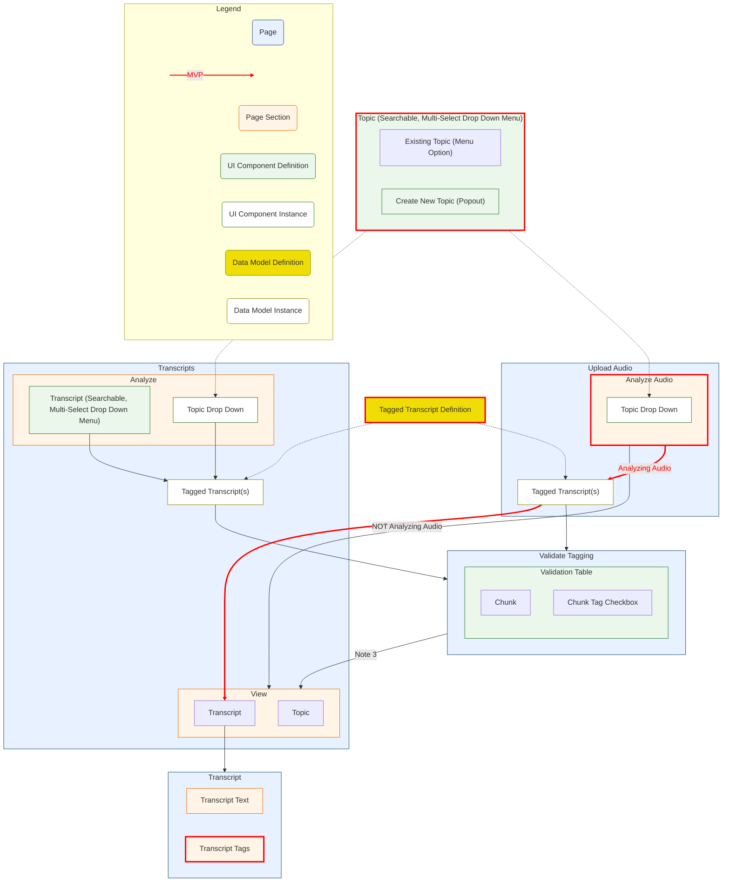

# Overview
- [x] Complete React UI Scaffolding
- [x] Plan out Overall UI Journey
- [x] Define MVP UI Journey
	- *MVP Risk* Have to do tagging at time of transcript creation, can't go back.
	- Planned to be implemented "later"
- [ ] Create Clickable UI Scaffolding for MVP UI Journey
- [ ] Pull in actual tagging code
- [ ] Dev deployment of MVP to enable testing with Andy
- [ ] Address Andy's feedback
- [ ] Prod deployment of MVP
- [ ] Define implementation phases
	1. Add ability to tag transcripts after initial audio upload
	2. Add ability to validate tagging

# 1 Complete the React UI Scaffolding stuff

# 2. Plan out the UI journey

**Notes**
1. Create New Topic Popout
	- On Submit of form, refresh full Analyze page (ensures the Topic dropdown menu includes the new topic)
	- Need to maintain state with the selections of the topics and transcripts so that if a user creates a new topic they don't have to re-enter previous selections.  State for the drop down menus should get cleared, however, if they do anything other than go through the process of creating a new topic.  Likely needs to be maintained throughout the process of validating the tagging to ensure that the view is correct
2. Validate Tagging
	- For each chunk/topic combination within the transcript, have a checkbox that allows users to indicate whether that tag was captured correctly (defaults to the box being checked) and *capture both the initial and user feedback version of the tag within the data model*
	- Within the UI, this will look like a table with the check box embedded as a row.  Only include the transcript column if the user is selecting multiple transcripts at once
>		|  Transcript  | Chunk Text | Tag 1 | Tag 2 | ... | Tag N |
>		| ------------ | ---------- | ----- | ----- | --- | ----- |
>       | Transcript 1 | asdfasdfad |   Y   |   N   |  N  |   Y   |
3. Validated Tagging to View transition
	- Ensure that the selected transcript(s) are maintained in state to ensure that the view transitions to the relevant transcript
	- See discussion around maintaining state for the selections.
4. Transcript and Topic Selection
	- Users should be able to select multiple transcripts and topics
	- See discussion around maintaining state for the selections.
5. Transcripts Page Sidebar Menu
	- There needs to be a sidebar menu within the Transcripts page that 

# 3. Define MVP UI Journey
- See red highlighted section of diagram
- Required Elements to build out
	1. Analyze Audio Page Section
	2. Topic Drop Down
		- Create New Topic Poput
	3. Tagged transcript Data Model
	4. Transcript Tags Page Section
	

# 4. Create clickable UI scaffolding
Branching strategy: Main branch is `feat/transcript-tagging` and branches referenced below indicate the sub-branches
- [] Analyze Audio Page Section (branches: `feat/analyze-audio` > `feat/page-section`)
- [] Topic Drop Down Menu (branches: `feat/analyze-audio` > `feat/topic-drop-down`)
	- [] Create Topic Data Model
	- [] Create Base Menu
	- [] Create "Create New Topic" Popout Form
	- [] Integrate Base Menu with "Create New Topic" Popout Form
- [] Tagged transcript Data Model
- [] Transcript Tags Page Section

## Step 1: Build out "Analyze Audio" Page Section
- [x] Create the react component
    - checkbox that expands into a new section when selected that contains an explanatory hover
- [x] Bring the react component into the Django page

## Step 2: Create "Topic Drop Down Menu" UI Element
### UI Components
- [x] Provide data from the React Component to the Django form
    > Put <input type="hidden" name="component_json" id="component_json"> in the form.
    > In React, whenever state changes (or on submit), document.getElementById('component_json').value = JSON.stringify(state).
    > In the Django view: data = json.loads(request.POST['component_json']).
- [ ] Abstract multi-select from Page section into its own component
## Step 3: Create Transcript Tags section to Transcript page
- [ ] Create Tagging Data Model
    - Long (transcript_id, chunk_id, topic, topic_present) is probably better than wide (column for each topic)
- [ ] Create Chunk data model
    - transcript_id, chunk_id, chunk_text

## Step 4: Create ability to flow through UI spaces
- [ ] Create Topic Data Model
    - [] Pre-populate data based on andy's recommendation
- [ ] Populate with dummy data
- [ ] Have pages pull off SQLite rather than dummy data
- [ ] Add shell of `tag_data` capability

# Step 4. Add in actual tagging code

# N. Allow user to tag a transcript rather than just an audio file