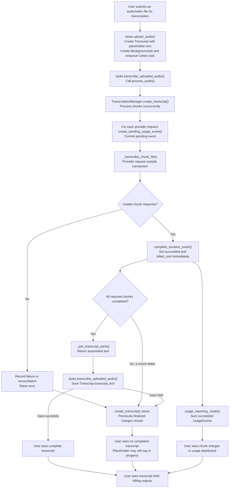

# Current transcription and billing flow

Compare side by side with [the proposed flow](TranscriptionBillingProposedFlow.md) by opening both Markdown previews.

This diagram shows the ordinary charge path. Billing-extraction errors can separately enter reconciliation.

