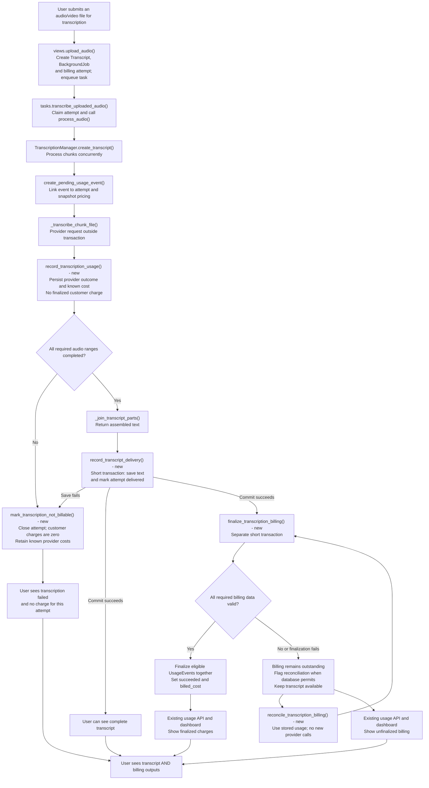

# Proposed delivery-based transcription billing flow

Compare side by side with [the current flow](TranscriptionBillingCurrentFlow.md) by opening both Markdown previews.

Functions marked "new" are proposed additions, not implemented code. A transcription-level billing attempt coordinates the existing chunk UsageEvents; it does not create a duplicate charge.

## Scope clarification

Historical repair of previously finalized events in the development/testing database is out of scope. Do not add correction migrations, repair commands, credits, or audit machinery solely to fix that existing test data. Focus implementation and validation on correct behavior for new attempts, including failures, crashes, retries, and reconciliation. This does not remove the protection against modifying finalized events in normal operation, and does not authorize deleting or resetting development data.

